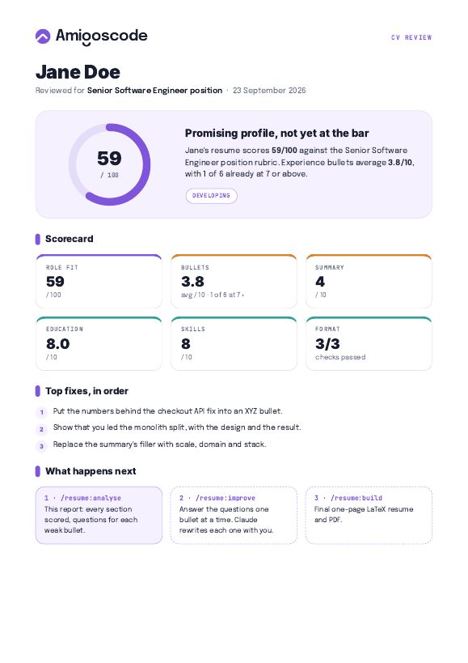
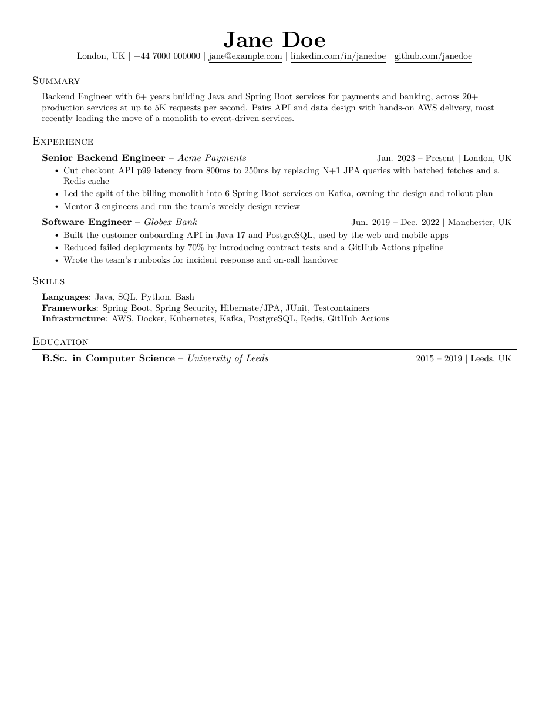

# resume

A Claude Code plugin that reviews your CV like a hiring rubric would, helps you rewrite it one bullet at a time, and builds a clean one-page LaTeX resume.

| Branded review report | Final one-page resume |
|---|---|
| [](examples/jane-doe/Jane_Doe_CV_Review.pdf) | [](assets/sample.pdf) |

## Commands

| Command | What it does | Output |
|---|---|---|
| `/resume:analyse` | Scores the whole CV: fit for the target role (hiring-agent style rubric), every experience bullet 0–10, the summary, skills, education and format. It plans each bullet (XYZ, strong without a metric, keep, merge or cut) and writes the questions you need to answer. | `<First_Last>_CV_Review.pdf` (Amigoscode branded) and `review.json` |
| `/resume:improve` | Goes one bullet at a time: asks the questions, rewrites the bullet with your answers, and re-scores it. Then does the same for the summary and education. It keeps a balance: about a third of the bullets get XYZ with a real number, and the rest are strong without one. It never invents numbers. | updated `review.json` and a scored preview PDF |
| `/resume:build` | Renders the final resume on a modified [Jake's Resume](https://github.com/jakegut/resume) template. It checks the resume fits one page and that no line runs past the margin. | `<First_Last>_Resume.tex` and `.pdf` |

Everything for one person lives in `./<first-last>/`. `review.json` carries the state between commands, so you can stop and pick up again later.

### How bullets are scored

Bullets are scored against Google's XYZ format: *accomplished [X], as measured by [Y], by doing [Z]*.

| Score | The bullet has |
|---|---|
| 0–2 | A duty or a vague claim ("Helped teams achieve goals") |
| 3–4 | A clear task with specific tech or scope, but no result |
| 5–6 | A task plus one strong element: a number, scope, ownership or an outcome |
| 7–8 | A clear result plus how it was done: a metric, or strong scope, ownership and tech |
| 9–10 | Full XYZ: a meaningful result, a real measure and a specific method |

If every bullet has a percentage, the resume looks fabricated. The plan keeps XYZ bullets to roughly 30–40%. The others get their strength from scope, ownership, specific tools and outcomes described in words.

### Role rubrics

Adapted from HackerRank's open-source [hiring-agent](https://github.com/interviewstreet/hiring-agent):

- `software_engineering_intern`
- `junior_software_engineer`
- `mid_level_software_engineer`
- `senior_software_engineer`
- `engineering_manager`

For any other role (solutions architect, PM, designer, and so on), `/resume:analyse` writes a custom rubric in the same shape and says so in the report.

## Install

In Claude Code:

```
/plugin marketplace add amigoscode/resume
/plugin install resume@amigoscode
```

You'll also need:
- **A LaTeX compiler:** `brew install tectonic`. It's about 20 MB and builds in seconds. `pdflatex` works too.
- **Google Chrome, Chromium or Edge:** used to print the branded report to PDF.
- **Python 3.9+:** the scripts use only the standard library.

Then:

```
/resume:analyse ~/Downloads/my-cv.pdf, I'm targeting senior backend roles
```

## Layout

```
.claude-plugin/          plugin + marketplace manifests
skills/analyse/          /resume:analyse
skills/improve/          /resume:improve
skills/build/            /resume:build
references/              bullet and summary rubrics, review.json schema
rubrics/                 hiring rubrics per role (role.json + criteria.md)
report/                  report stylesheet, Amigoscode wordmark and fonts
scripts/make_report.py   review.json -> branded review PDF
scripts/render_tex.py    review.json -> resume .tex (with --scores for a scored preview)
scripts/build.sh         .tex -> .pdf, page count and margin-overflow check
assets/template.tex      the LaTeX template
examples/jane-doe/       a sample review.json and its report
```

## Build without Claude

```bash
python3 scripts/render_tex.py examples/jane-doe/review.json Jane_Doe_Resume.tex
scripts/build.sh Jane_Doe_Resume.tex --open
python3 scripts/make_report.py examples/jane-doe/review.json
```

## Credits

- Resume template: [jakegut/resume](https://github.com/jakegut/resume) by Jake Gutierrez, based on [sb2nov/resume](https://github.com/sb2nov/resume). MIT.
- Role rubrics: adapted from [interviewstreet/hiring-agent](https://github.com/interviewstreet/hiring-agent) by HackerRank. MIT, see `rubrics/LICENSE-hiring-agent`.
- Summary guidance: [FAANG Tech Leads](https://www.faangtechleads.com/resume/professional-summary).
- Fonts: Epilogue and JetBrains Mono, both SIL Open Font License.
